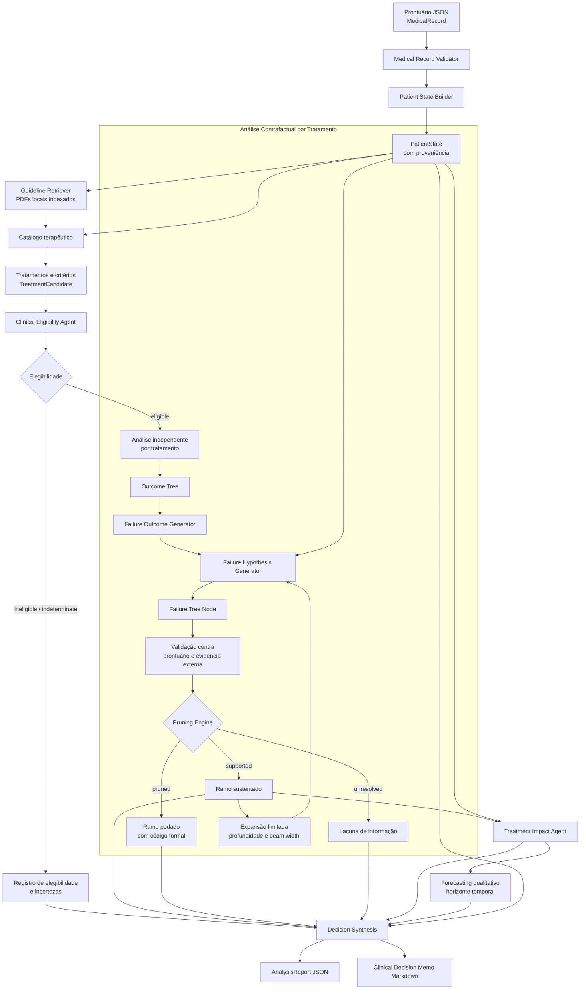

# Sistema Multiagente de Prognóstico para Câncer de Tireoide

MVP auditável de apoio à análise terapêutica para câncer de tireoide confirmado. O sistema não diagnostica, não prescreve e não seleciona automaticamente um tratamento.

## Pipeline

```text
MedicalRecord JSON
  -> MedicalRecordValidator
  -> PatientStateBuilder com proveniência
  -> catálogo terapêutico + recuperação local de diretrizes
  -> avaliação determinística de elegibilidade
  -> árvores independentes de desfecho e falha por tratamento elegível
  -> validação e poda formal
  -> Treatment Impact Agent
  -> prognóstico qualitativo
  -> relatório JSON + Markdown
```

## Arquitetura


```mermaid
flowchart TD
    A[Prontuário JSON\nMedicalRecord] --> B[Medical Record Validator]
    B --> C[Patient State Builder]
    C --> D[PatientState\ncom proveniência]

    D --> E[Guideline Retriever\nPDFs locais indexados]
    D --> F[Catálogo terapêutico]
    E --> F
    F --> G[Tratamentos e critérios\nTreatmentCandidate]

    G --> H[Clinical Eligibility Agent]
    H --> I{Elegibilidade}
    I -->|eligible| J[Análise independente\npor tratamento]
    I -->|ineligible / indeterminate| K[Registro de elegibilidade\ne incertezas]

    subgraph ANALYSIS[Análise Contrafactual por Tratamento]
        J --> L[Outcome Tree]
        L --> M[Failure Outcome Generator]
        M --> N[Failure Hypothesis Generator]
    D --> N
        N --> O[Failure Tree Node]
        O --> P[Validação contra\nprontuário e evidência externa]
        P --> Q{Pruning Engine}
        Q -->|supported| R[Ramo sustentado]
        Q -->|pruned| S[Ramo podado\ncom código formal]
        Q -->|unresolved| T[Lacuna de informação]
        R --> U[Expansão limitada\nprofundidade e beam width]
        U --> N
    end

    R --> V[Treatment Impact Agent]
    D --> V
    V --> W[Forecasting qualitativo\nhorizonte temporal]

    K --> X[Decision Synthesis]
    R --> X
    S --> X
    T --> X
    V --> X
    W --> X
    D --> X

    X --> Y[AnalysisReport JSON]
    X --> Z[Clinical Decision Memo Markdown]
```

Os candidatos são dinâmicos. Uma hipótese de falha somente permanece na árvore quando contém condição do paciente, cadeia causal explícita, evidência do prontuário e suporte da base externa recuperada. Ausência de dados resulta em `UNRESOLVED_MISSING_DATA`; não é tratada como normalidade. A ausência de mecanismo suportado não demonstra eficácia.

## Componentes

- `src/prognostico/record.py`: validação de datas, cronologia e conflitos temporais.
- `src/prognostico/state.py`: estado clínico resumido com evidências de origem.
- `src/prognostico/treatment_catalog.py`: catálogo versionado e critérios explícitos de aplicabilidade.
- `src/prognostico/eligibility.py`: decisão determinística de elegibilidade antes da expansão das árvores.
- `src/prognostico/guidelines.py`: ingestão de PDFs, indexação com página e recuperação local citável.
- `src/prognostico/thyroid_pipeline.py`: árvores, poda, impacto e relatório estruturado.
- `examples/caso_prognostico.json`: caso sintético de carcinoma papilífero metastático.

## Uso

Instale o Qwen no Ollama:

```bash
ollama pull qwen2.5:7b
```

Indexe as diretrizes locais após atualizar os PDFs em `guidelines/`:

```bash
PYTHONPATH=src python3 -m prognostico.guideline_ingest guidelines
```

Execute a análise:

```bash
PYTHONPATH=src python3 -m prognostico.cli examples/caso_prognostico.json --guideline-index guidelines/processed/index.json --out outputs/thyroid_report.json
```

O comando grava `outputs/thyroid_report.json` e `outputs/thyroid_report.md` usando o modelo configurado no Ollama.

## Limites do MVP

- O escopo inicial é carcinoma diferenciado de tireoide, com caso sintético.
- A previsão é qualitativa em horizonte de 12 meses. Não há probabilidade numérica nem calibração sem conjunto de validação.
- As diretrizes recuperadas são trechos locais com identificação de documento e página; elas não substituem avaliação por especialista ou validação clínica.

## Testes

```bash
pytest
```

Os testes cobrem validação, proveniência do estado, recuperação de diretrizes, elegibilidade do catálogo, árvores independentes e poda de condição ausente.
